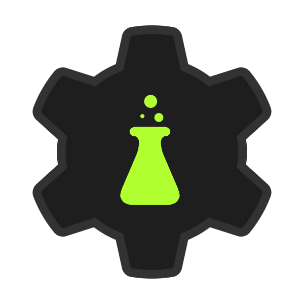

# 🏴‍☠️ Welcome to Infinite.
**Infinite** is a human community of hackers and enthusiasts from around the world. We believe in the freedom of the technologies we use, and we hack every day to empower people to be independent, free, and open.

We actively create and adapt technologies to achieve a safer and healthier digital world. In short, we hack for good.

### We create projects :

|                | **Name**                                                                                                         |  **Description**                                                                                                                                           |
|-------------------------|--------------------------------------------------------------------------------------------------------------------|--------------------------------------------------------------------------------------------------------------------------------------------------------------|
|  | [**Vortex**](https://github.com/infiniteHQ/Vortex)                                                                  | Vortex is a comprehensive open creation platform offering a variety of tools for creators and developers. It enables the creation of systems, applications, services, and much more. |
  | **Hypernet**                                                                                                       | Hypernet is an advanced networking technology designed around a sandbox paradigm, enabling extensive modding and customization. Originally created to push the boundaries of decentralized networking and environmental networking. |
|    | **Labs**                                                                                                           | Infinite Labs is a sharing platform for makers, aimed at simplifying the process of creating and developing projects. It offers a variety of tools and resources to help creators streamline their workflows and enhance productivity. |

### We create initiatives :

### We create devtools :
|                | **Name**                                                                                                         |  **Description**                                                                                                                                           |
|-------------------------|--------------------------------------------------------------------------------------------------------------------|--------------------------------------------------------------------------------------------------------------------------------------------------------------|
|  | [**Cherry**](https://github.com/infiniteHQ/Cherry)                                                                  | Vortex is a comprehensive open creation platform offering a variety of tools for creators and developers. It enables the creation of systems, applications, services, and much more. |

### We create tools :
|  | [**Cherry**](https://github.com/infiniteHQ/Cherry)                                                                  | Vortex is a comprehensive open creation platform offering a variety of tools for creators and developers. It enables the creation of systems, applications, services, and much more. |
  | **Hypernet**                                                                                                       | Hypernet is an advanced networking technology designed around a sandbox paradigm, enabling extensive modding and customization. Originally created to push the boundaries of decentralized networking and environmental networking. |
|    | **Labs**                                                                                                           | Infinite Labs is a sharing platform for makers, aimed at simplifying the process of creating and developing projects. It offers a variety of tools and resources to help creators streamline their workflows and enhance productivity. |

<!--

**Here are some ideas to get you started:**

🙋‍♀️ A short introduction - what is your organization all about?
🌈 Contribution guidelines - how can the community get involved?
👩‍💻 Useful resources - where can the community find your docs? Is there anything else the community should know?
🍿 Fun facts - what does your team eat for breakfast?
🧙 Remember, you can do mighty things with the power of [Markdown](https://docs.github.com/github/writing-on-github/getting-started-with-writing-and-formatting-on-github/basic-writing-and-formatting-syntax)
-->
