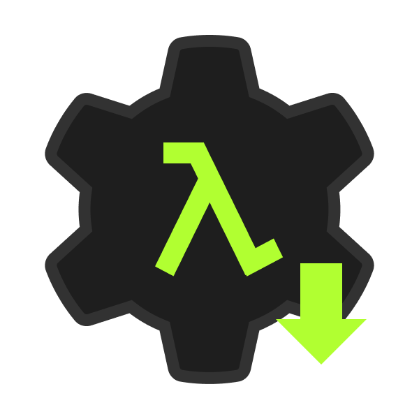

# 🏴‍☠️ Welcome to Infinite.
**Infinite** is a human community of hackers and enthusiasts from around the world. We believe in the freedom of the technologies we use, and we hack every day to empower people to be independent, free, and open.

We actively create and adapt technologies to achieve a safer and healthier digital world. In short, we hack for good.

### We create projects :

|                                                                                                        |                                                                                                                                          | **Description**
|---------------------------------------------------------------------------------------------------------------------------------------------|--------------------------------------------------------------------------------------------------------------------------------------------------------------|
|  |[**Vortex**](https://github.com/infiniteHQ/Vortex) is a comprehensive open creation platform offering a variety of tools for creators and developers. It enables the creation of systems, applications, services, and much more. |
  | **Hypernet** is an advanced networking technology designed around a sandbox paradigm, enabling extensive modding and customization. Originally created to push the boundaries of decentralized networking and environmental networking. |
|    | [**The Infinite Garage**](https://garage.infinite.si/) is a sharing platform for makers, aimed at simplifying the process of creating and developing projects. It offers a variety of tools and resources to help creators streamline their workflows and enhance productivity. |

### We create devtools :
|                |                                                                                                                                   |
|--------------------------------------------------------------------------------------------------------------------------------------------|--------------------------------------------------------------------------------------------------------------------------------------------------------------|
|   | [**Cherry**](https://github.com/infiniteHQ/Cherry) is a modern, minimalist yet comprehensive UI/UX framework for low-level native applications. It provides a complete solution, including backend support, a rendering engine, and UI components. Built using technologies like ImGui, Vulkan, and SDL. |

### We create tools :            
| |                                                                                                                                      |
|----------------------------------------------------------------------------------------------------------------------------------------|--------------------------------------------------------------------------------------------------------------------------------------------------------------|
|   | The [**Vortex Launcher**](https://github.com/infiniteHQ/VortexLauncher) is an easy-to-use tool that helps you create Vortex projects, manage your tools and projects, add content from the community, and share your own content too! |
|   | The [**Vortex Installer**](https://github.com/infiniteHQ/VortexInstaller) is a straightforward utility designed to install or update the Vortex Launcher. It focuses exclusively on the launcher itself, without affecting the Vortex core or any other internal components. This tool ensures that only the launcher is kept up-to-date, leaving the rest of the system unchanged. |

### We create initiatives :
|                                                                                                      |  **Description**                                                                                                                                           |
|--------------------------------------------------------------------------------------------------------------------|--------------------------------------------------------------------------------------------------------------------------------------------------------------|
| **Learning**                                                                |Infinite aims to teach security, programming and hacking to young or vulnerable people and raise awareness to promote a healthy approach to computing.
   

## Useful Links  
Below are some important links related to Infinite. Click on the icons to visit the respective sites.  

  
  <table>
    <tr>
      <td align="center">
        <a href="https://infinite.si/">
           
          <strong>Infinite Website</strong>
        </a>
      </td>
      <td align="center">
        <a href="https://vortex.infinite.si/">
           
          <strong>Vortex Website</strong>
        </a>
      </td>
      <td align="center">
        <a href="https://cherry.infinite.si/">
           
          <strong>Cherry Website</strong>
        </a>
      </td>
      <td align="center">
        

           
          <strong>InfiSec Website (WIP)</strong>
        

      </td>
    </tr>
    <tr>      <td align="center">
        <a href="https://fund.infinite.si/">
           
          <strong>Funding & Sponsors</strong>
        </a>
      </td>
      <td align="center">
        <a href="https://garage.infinite.si/">
           
          <strong>Garage Website</strong>
        </a>
      </td>
      <td align="center">
        <a href="https://accounts.infinite.si/">
           
          <strong>Infinite Accounts</strong>
        </a>
      </td>
      <td align="center">
        <a href="https://discord.com/invite/H2wptkecUg">
           
          <strong>Discord</strong>
        </a>
      </td>
    </tr>
  </table>

